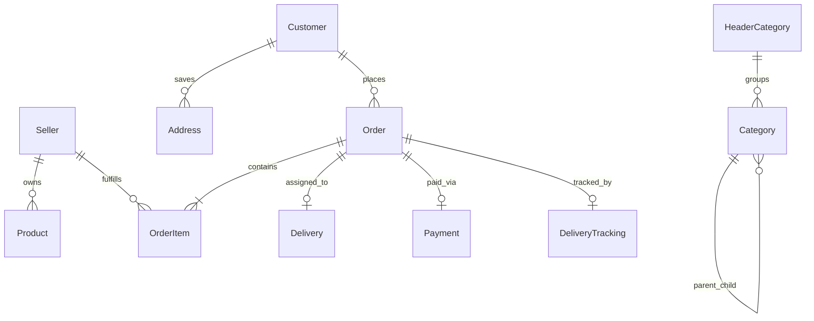
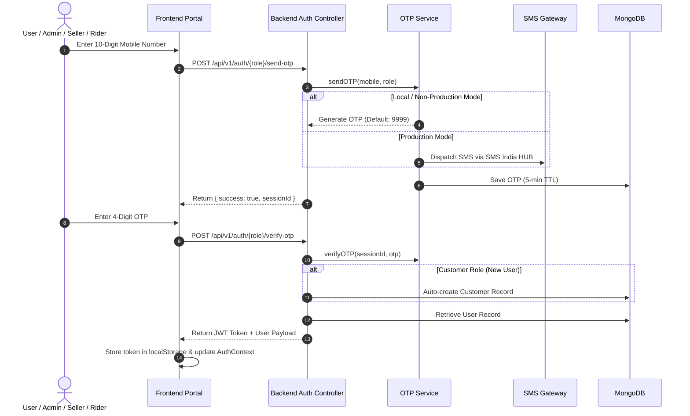
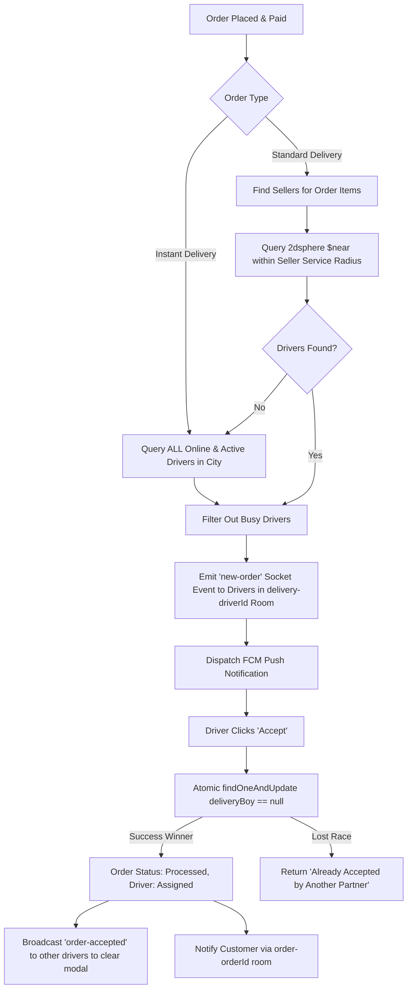
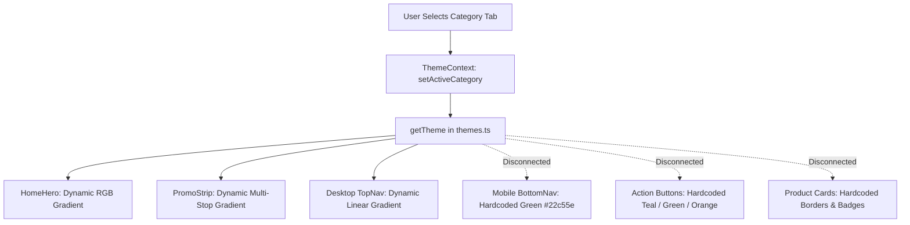
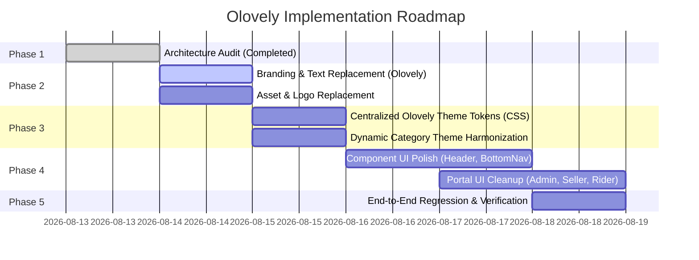

# 🔎 Olovely — Complete Project Rescan & Architecture Audit

**Brand Target:** Olovely (Olovely Total Suvidha)  
**Audit Scope:** Full repository scan (Frontend, Backend, Database, Real-Time Sockets, Theme Engine, Legacy Branding, Security & Infrastructure)  
**Status:** Audit Complete — Zero source code modified (Read-Only Scan)

---

## 1. Executive Summary

This codebase is a production-grade Quick-Commerce (10–15 minute delivery) platform built on the MERN stack with TypeScript. It includes **4 distinct sub-systems**:
1. **Customer Web App / Mobile Web Storefront** (Fast grocery shopping, dynamic categories, real-time order tracking, address book, wallet).
2. **Seller / Vendor Management Portal** (`/seller`) (Catalog & inventory management, order processing, settlement, seller wallet, shop open/close toggle).
3. **Delivery Partner / Rider Portal** (`/delivery`) (Live assignment broadcast, GPS tracking, accept/reject offers, order fulfillment OTP, earnings & cash collection).
4. **Admin Dashboard** (`/admin`) (Comprehensive system management, category hierarchy, order oversight, seller approvals, driver manual assignment, banner & home section CMS, tax & withdrawal management).

### Key Audit Metrics
| Metric | Count / Status |
| :--- | :--- |
| **Total Files Inspected** | 185+ source files |
| **Total Mongoose Models** | 44 models |
| **Active Portals** | 4 (Customer, Admin, Seller, Delivery) |
| **Legacy Branding References ("Dhakad Snazzy")** | 270+ occurrences |
| **Legacy Branding References ("Zoogno")** | 0 occurrences in source code |
| **Theme / Color Sources** | 4 disparate layers (Tailwind, `themes.ts`, inline styles, component hardcodes) |
| **Active Home Page Sections** | 6 primary rendered section blocks |
| **Real-Time Sockets** | Socket.IO with 4 primary room patterns |
| **Payment Gateway** | Razorpay (Active) |
| **Background Processing** | In-memory asynchronous orchestrator (No Redis / BullMQ currently running) |

---

## 2. Project Structure

```text
Dhakad-Snazzy-quick-commerce (Root)
│
├── backend
│   ├── .env                                  # Server, DB, JWT, Maps, Firebase, SMS & Razorpay configuration
│   ├── package.json                          # Backend dependencies & seeding scripts
│   ├── tsconfig.json                         # TypeScript configuration
│   │
│   ├── src
│   │   ├── config
│   │   │   └── db.ts                         # Mongoose MongoDB connection initializer
│   │   ├── middleware
│   │   │   ├── auth.ts                       # JWT validation & userType RBAC middleware
│   │   │   ├── errorHandler.ts               # Global error response handler
│   │   │   ├── notFound.ts                   # 404 route handler
│   │   │   └── rateLimiter.ts                # express-rate-limit configurations (OTP/Login)
│   │   ├── models                            # 44 Mongoose models (Order, Customer, Seller, Delivery, etc.)
│   │   ├── modules
│   │   │   ├── admin                         # Admin controllers & services
│   │   │   ├── customer                      # Customer controllers & routes
│   │   │   ├── delivery                      # Delivery partner controllers & tracking routes
│   │   │   └── seller                        # Seller controllers & services
│   │   ├── routes
│   │   │   ├── index.ts                      # Central router mounting all /api/v1 endpoints
│   │   │   ├── adminAuthRoutes.ts            # Admin OTP & registration routes
│   │   │   ├── adminRoutes.ts                # Admin dashboard, CMS, and management routes
│   │   │   ├── customerAuthRoutes.ts         # Customer SMS OTP login & auto-registration
│   │   │   ├── customerHomeRoutes.ts         # Customer home CMS content API
│   │   │   ├── deliveryAuthRoutes.ts         # Delivery partner SMS OTP & registration
│   │   │   ├── deliveryRoutes.ts             # Delivery orders, status, and earnings
│   │   │   ├── paymentRoutes.ts              # Razorpay order creation & webhook
│   │   │   ├── sellerAuthRoutes.ts           # Seller OTP & shop toggle
│   │   │   └── sellerRoutes.ts               # Seller product & order management
│   │   ├── scripts                           # DB seed scripts, migrations & test runners
│   │   ├── services
│   │   │   ├── firebaseAdmin.ts              # Firebase Admin SDK & FCM push notifications
│   │   │   ├── jwtService.ts                 # JWT token signing and verification
│   │   │   ├── mapService.ts                 # Google Maps Geocoding & distance calculation
│   │   │   ├── orderAlertService.ts          # Delivery order offer state persistence
│   │   │   ├── orderFulfillmentOrchestrator.ts # Order fulfillment lifecycle manager
│   │   │   ├── orderNotificationService.ts   # Real-time driver broadcast ($near & Haversine)
│   │   │   ├── otpService.ts                 # SMS India HUB gateway & development bypass logic
│   │   │   ├── paymentService.ts             # Razorpay API integration & HMAC signature verification
│   │   │   └── sellerNotificationService.ts  # Real-time seller order event emitter
│   │   ├── socket
│   │   │   └── socketService.ts              # Socket.IO server, room management & GPS ingestion
│   │   └── utils
│   │       ├── cache.ts                      # In-memory TTL response cache
│   │       ├── ensureDefaultAdmin.ts         # Automatic seed for default admin
│   │       └── seedHeaderCategories.ts       # Automatic seed for default header categories
│   └── uploads                               # Local static uploads directory
│
└── frontend
    ├── .env                                  # Vite environment variables (API URL, Maps, Firebase)
    ├── index.html                            # HTML entry point, fonts, preloads & viewport
    ├── package.json                          # Frontend dependencies & build scripts
    ├── tailwind.config.js                    # Tailwind theme configuration
    ├── vite.config.ts                        # Vite configuration with chunk splitting
    │
    ├── scripts
    │   └── copy-images.js                    # Pre-build asset synchronization script
    │
    └── src
        ├── main.tsx                          # React DOM client root & anti-flash background setup
        ├── App.tsx                           # Master React Router configuration (40+ routes)
        ├── index.css                         # Tailwind base layers & global utilities
        ├── components
        │   ├── AppLayout.tsx                 # Core Customer layout (TopNav, Location, BottomNav)
        │   ├── FloatingCartPill.tsx          # Floating bottom cart indicator
        │   ├── GoogleMapsTracking.tsx        # Live GPS order tracking map with Google Maps
        │   ├── LocationPermissionRequest.tsx # Location permission modal (mandatory/change)
        │   ├── OTPInput.tsx                  # 4-digit auto-advancing OTP input component
        │   ├── PageLoader.tsx                # Skeleton & loading spinners
        │   ├── ProtectedRoute.tsx            # Role-based route guard
        │   ├── PublicRoute.tsx               # Auth redirect guard for logged-in users
        │   └── RazorpayCheckout.tsx          # Razorpay payment checkout script launcher
        ├── context
        │   ├── AuthContext.tsx               # Auth state (JWT token, user profile, role)
        │   ├── CartContext.tsx               # Shopping cart state, local persistence & discounts
        │   ├── LoadingContext.tsx            # Global route transition loader state
        │   ├── LocationContext.tsx           # GPS geolocation, reverse geocoding & address state
        │   ├── OrdersContext.tsx             # Active orders cache
        │   ├── ThemeContext.tsx              # Active category tab & dynamic theme provider
        │   ├── ToastContext.tsx              # Global toast notification provider
        │   └── WishlistContext.tsx           # Wishlist items state
        ├── modules
        │   ├── admin                         # Admin portal components & 40+ management pages
        │   ├── delivery                      # Rider portal components, earnings, orders & live navigation
        │   ├── seller                        # Seller portal dashboard, inventory, products & reports
        │   └── user                          # Customer storefront (Home, Search, Cart, Checkout, etc.)
        ├── services
        │   ├── api                           # Axios API client instances and endpoint helpers
        │   ├── firebase.ts                   # Firebase Client SDK & Cloud Messaging
        │   └── pushNotificationService.ts    # Service worker registration & FCM web push handler
        └── utils
            ├── apiCache.ts                   # Client-side API caching helper
            ├── priceUtils.ts                 # Price & MRP calculation utilities
            └── themes.ts                     # Hardcoded category theme color dictionary
```

---

## 3. Frontend Architecture

* **Framework & Core:** React `v18.2.0`, Vite `v7.3.0`, TypeScript `v5.2.2`.
* **Routing:** `react-router-dom` `v6.20.0` with lazy-loading (`lazyWithRetry`) and code splitting.
* **State Management:** React Context API with 9 global providers:
  1. `AuthProvider` (Token & user type management in `localStorage`)
  2. `LocationProvider` (Coordinates, address reverse geocoding, serviceability)
  3. `ThemeProvider` (Active category tab & dynamic color lookup)
  4. `CartProvider` (Cart items, quantities, pricing, seller validation)
  5. `OrdersProvider` (Order history & active order status)
  6. `WishlistProvider` (Customer favorited products)
  7. `ToastProvider` (UI toast notifications)
  8. `LoadingProvider` (Global page loading overlay)
  9. `AxiosLoadingInterceptor` (Automatic spinner triggering on network requests)
* **Animation & UI:** Framer Motion `v10.16.16`, GSAP `v3.12.5`, Lottie React `v2.4.1`, ApexCharts `v5.3.6`, Recharts `v3.6.0`.
* **Maps & Geolocation:** Google Maps JavaScript API via `@react-google-maps/api` `v2.20.8` and Leaflet `v1.9.4`.

---

## 4. Backend Architecture

* **Runtime & Framework:** Node.js, Express `v4.18.2`, TypeScript `v6.0.3` running via `tsx` watch.
* **Database Client:** Mongoose `v8.0.3` connected to MongoDB Atlas.
* **Real-Time Layer:** Socket.IO `v4.8.1` handling live GPS tracking, delivery broadcasts, and seller order notifications.
* **Authentication:** Stateless JWT (`jsonwebtoken` `v9.0.3`) with `7d` expiration and role verification middleware.
* **SMS & OTP:** SMS India HUB HTTP API with automatic development bypass (`9999`).
* **Payment Processing:** Official Razorpay Node SDK `v2.9.6` for order creation and crypto HMAC signature verification.
* **Push Notifications:** Firebase Admin SDK `v13.6.0` for multicast web & mobile device tokens.
* **Storage:** Multer `v2.0.2` supporting Cloudinary `v2.8.0` and local VPS storage under `/uploads`.

---

## 5. Database Architecture

The system uses **44 Mongoose models**. Key schemas and relationships:



### Key Models & Indexes
| Model | Key Fields | Indexes | Enums / Constraints |
| :--- | :--- | :--- | :--- |
| **`Customer`** | `phone`, `name`, `email`, `walletAmount`, `fcmTokens`, `status` | `phone` (unique), `email` (sparse) | `status`: Active, Inactive, Blocked |
| **`Admin`** | `mobile`, `email`, `password`, `role`, `permissions` | `mobile` (unique), `email` (unique) | `role`: Super Admin, Admin, Manager |
| **`Seller`** | `sellerName`, `mobile`, `storeName`, `location`, `serviceRadiusKm`, `status`, `isShopOpen` | `location` (`2dsphere`), `mobile` (unique) | `status`: Pending, Active, Suspended |
| **`Delivery`** | `name`, `mobile`, `location`, `isOnline`, `status`, `balance`, `cashCollected` | `location` (`2dsphere`), `mobile` (unique) | `status`: Active, Inactive, Blocked |
| **`Order`** | `orderNumber`, `customer`, `deliveryBoy`, `total`, `status`, `paymentStatus`, `deliveryOption` | `orderNumber` (unique), `customer`, `status` | `status`: Pending, Received, Processed, Shipped, Out for Delivery, Delivered, Cancelled |
| **`DeliveryTracking`** | `order`, `deliveryBoy`, `currentLocation`, `route`, `distance`, `eta`, `status` | `order` (unique), `deliveryBoy` | `status`: idle, in_transit, nearby, arrived, picked_up, delivered |
| **`Category`** | `name`, `slug`, `image`, `order`, `parentId`, `headerCategoryId`, `status` | `slug` (unique), `order`, `parentId` | `status`: Active, Inactive |
| **`HeaderCategory`** | `name`, `slug`, `iconName`, `order`, `status` | `slug` (unique), `order` | `status`: Published, Unpublished |
| **`HomeSection`** | `title`, `displayType`, `columns`, `order`, `isActive`, `data` | `order`, `isActive` | `displayType`: categories, products |
| **`Payment`** | `order`, `customer`, `razorpayOrderId`, `razorpayPaymentId`, `amount`, `status` | `razorpayOrderId`, `order` | `status`: Pending, Completed, Failed, Refunded |

---

## 6. Authentication

The system implements 4 separate authentication channels using **Mobile Number + 4-digit OTP**:



---

## 7. Payment Architecture (Razorpay)

* **Initiation:** Customer clicks Checkout -> Frontend calls `POST /api/v1/payment/create-order` -> Backend initializes Razorpay Order with order amount in paise (`amount * 100`) and returns `razorpayOrderId`.
* **Client SDK:** Frontend loads Razorpay Checkout modal with `RAZORPAY_KEY_ID`.
* **Verification:** Upon payment completion on client, frontend calls `POST /api/v1/payment/verify` with `razorpayOrderId`, `razorpayPaymentId`, and `razorpaySignature`.
* **Security:** Backend verifies the HMAC SHA256 signature using `RAZORPAY_KEY_SECRET`.
* **State Transition:** On valid signature, `Payment` document status transitions to `Completed`, `Order` paymentStatus transitions to `Paid` (and status transitions from `Pending` to `Received`), and `notifySellersOfOrderUpdate` is emitted via Socket.IO.
* **Cash On Delivery (COD):** Dedicated flow updating `PaymentMethod: Cash` and assigning cash collection balance tracking to the delivery partner upon delivery.

---

## 8. Delivery & Rider Architecture



---

## 9. Real-Time Socket Architecture

Socket.IO server runs on the same HTTP server (`/socket.io`) with authenticated room management:

| Room Pattern | Audience | Purpose | Key Events Emitted |
| :--- | :--- | :--- | :--- |
| **`order-{orderId}`** | Customer & Assigned Driver | Live GPS Tracking & Status | `location-update`, `delivery-boy-accepted`, `order-rejected` |
| **`delivery-{driverId}`** | Specific Delivery Partner | Direct order offer dispatch | `new-order`, `order-rejection-acknowledged` |
| **`delivery-notifications`** | All Active Delivery Partners | Broadcast channel & cleanup | `order-accepted`, `order-rejected-by-all` |
| **`seller-{sellerId}`** | Specific Seller | Store order alerts | `new-order`, `order-status-update`, `order-cancelled` |

---

## 10. Queue & Background Worker Architecture

* **Current Implementation:** Monolithic in-process event handling.
* **Timers & Intervals:** In-memory `setInterval` handles cache expiration (`cache.cleanExpired()` every 5 mins) and driver location throttling (`30s` throttle per order in memory before persisting to MongoDB).
* **Async Orchestrator:** `orderFulfillmentOrchestrator.ts` coordinates seller preparation timers and auto-cancellation safety timeouts asynchronously.
* **Redis / BullMQ Status:** Redis configuration exists in environment specifications but is **not active/imported** in the runtime code.

---

## 11. Current UI Theme Architecture

### Finding: How Colors Are Currently Applied
The visual theme is **distributed across 4 disparate layers**:

1. **`frontend/src/utils/themes.ts` (Primary Dynamic Layer):**  
   Contains a hardcoded JavaScript dictionary mapping category slug keys (`all`, `wedding`, `winter`, `electronics`, `beauty`, `grocery`, `fashion`, `sports`, `orange`, `violet`, `teal`, `dark`, `hotpink`, `gold`) to 4-stop RGB gradient arrays and text colors.
2. **`frontend/tailwind.config.js` (Base Token Layer):**  
   Defines static colors `primary: '#FFC94A'` (yellow) and `cream: '#FFF7E0'`, but these are rarely used by the main components.
3. **`frontend/src/index.css` (Global Layer):**  
   Hardcoded `#ffffff` backgrounds on `html`, `body`, `#root`.
4. **Component Inline Styles & Tailwind Utility Classes (Hardcoded Overrides):**  
   * Many components (e.g. `AppLayout.tsx`, `FeaturedThisWeek.tsx`, `PromoStrip.tsx`) contain hardcoded green (`#22c55e`, `bg-green-600`), orange (`bg-orange-50`), and yellow classes instead of referencing a single centralized theme token.



---

## 12. Dynamic Category Theme Flow

When a user selects a category tab on the customer Home page:
1. `HomeHero` invokes `onTabChange(tabId)` -> updates `ThemeContext.activeCategory`.
2. `getTheme(activeCategory)` returns the corresponding RGB color stops (`primary[0..3]`, `accentColor`, `textColor`, `bannerText`, `saleText`).
3. **What ACTUALLY changes dynamically:**
   * ✅ `HomeHero` background gradient (`linear-gradient(to bottom right, primary[0], primary[1], primary[2])`).
   * ✅ `PromoStrip` multi-stop background gradient & banner text (`HOUSEFULL`, `GROCERY SALE`, etc.).
   * ✅ Desktop Top Navigation background gradient.
   * ✅ Sticky search bar background opacity blend on scroll.
4. **What DOES NOT change (Static / Hardcoded):**
   * ❌ Mobile Bottom Navigation icons and active states (hardcoded `#22c55e`).
   * ❌ Add to Cart buttons (hardcoded teal/green).
   * ❌ Category Tile backgrounds (`bg-cyan-50`, `bg-yellow-50`).
   * ❌ Featured This Week & Shop by Store cards (static gradients).
   * ❌ Checkout & Cart action buttons.

---

## 13. Complete Customer Home Page Section Map

Rendered in order from top to bottom on `/` (`Home.tsx`):

| # | Section Name | Component | File Path | Background & Color Logic | Dynamic / Hardcoded | Category-Aware? |
| :-: | :--- | :--- | :--- | :--- | :--- | :-: |
| **1** | **Desktop Top Navigation** *(Desktop only)* | `AppLayout` | `src/components/AppLayout.tsx` | Dynamic linear gradient from `currentTheme.primary[0..1]` | Dynamic from `themes.ts` | Yes |
| **2** | **Location & Delivery Header** | `HomeHero` (top section) | `src/modules/user/components/HomeHero.tsx` | Inherits `heroGradient` from `themes.ts`; text `#1f2937` | Dynamic from `themes.ts` | Yes |
| **3** | **Search Bar & Category Tabs** | `HomeHero` (sticky) | `src/modules/user/components/HomeHero.tsx` | Background blends from theme RGB to white on scroll (`scrollProgress`); indicator `#171717` | Dynamic + GSAP scroll blend | Yes |
| **4** | **Promo Strip / Housefull Banner** | `PromoStrip` | `src/modules/user/components/PromoStrip.tsx` | 5-stop dynamic gradient `primary[0..3]`; Crazy Deals card & 4 subcategory promo cards | Dynamic from `themes.ts` + CMS data | Yes |
| **5** | **Dynamic CMS Home Sections** | `CategoryTileSection` / `ProductCard` | `src/modules/user/components/CategoryTileSection.tsx` | Grid cards on `bg-neutral-50`; tile backgrounds `bg-cyan-50`, `bg-white` | Dynamic from Backend MongoDB `HomeSection` | Filterable by slug |
| **6** | **Filtered Products Grid** *(When tab != 'all')* | `ProductCard` grid | `src/modules/user/components/ProductCard.tsx` | White cards with border `border-neutral-200`; Add button `text-teal-600` | Dynamic from Product API | Yes |
| **7** | **Featured This Week** *(When tab == 'all')* | `FeaturedThisWeek` | `src/modules/user/components/FeaturedThisWeek.tsx` | Newly Launched (Yellow-Orange gradient) & Fresh Arrivals (Green gradient) | Hardcoded static gradients | No |
| **8** | **Shop by Store Grid** *(When tab == 'all')* | `Home.tsx` (inline grid) | `src/modules/user/Home.tsx` | White rounded cards with `border-neutral-200`; tile fallback `bg-neutral-50` | Dynamic from Shop API | No |
| **9** | **Mobile Bottom Navigation** *(Mobile only)* | `AppLayout` (bottom nav) | `src/components/AppLayout.tsx` | White fixed bar `border-neutral-200`; active icon fill `#22c55e`, stroke `#1f2937` | Hardcoded inline SVG colors | No |

---

## 14. Legacy Branding Audit ("Dhakad Snazzy" vs "Zoogno")

### Search Results for "Zoogno"
* Total matches in codebase: **0** (Clean ✅).

### Search Results for "Dhakad Snazzy" / "dhakadsnazzy"
* Total matches in codebase: **270+ occurrences** across 35+ files.

| Search Term | File | Category | User-Facing? | Technical? | Recommended Action |
| :--- | :--- | :--- | :-: | :-: | :--- |
| `Dhakad Snazzy - Fast Grocery Delivery` | `frontend/index.html` | A. User-Facing | Yes | No | Update title tag to `Olovely - Olovely Total Suvidha` |
| `Dhakad Snazzy Quick Commerce` | `frontend/src/modules/user/components/HomeHero.tsx` | A. User-Facing | Yes | No | Update header brand text to `Olovely Total Suvidha` |
| `Dhakad Snazzy` / `support@dhakadsnazzy.com` | `frontend/src/modules/user/AboutUs.tsx` | A & C. Legal/Support | Yes | No | Update company description, copyright, and support email |
| `dhakadsnazzy1.png` | `frontend/public/assets/`, `scripts/copy-images.js` | E. Asset Names | Yes | Yes | Replace logo asset with new Olovely multi-color logo |
| `loginvideo.mp4` / login assets | `frontend/public/assets/login/` | E. Asset Names | Yes | No | Review video branding if visible |
| `Dhakad Snazzy - 10 Minute App` (Invoices) | `frontend/src/modules/seller/pages/SellerOrderDetail.tsx` | A & C. Invoices | Yes | No | Update PDF invoice header, legal entity & footer |
| `dhakad-snazzy-backend` | `backend/package.json` | B. Technical | No | Yes | Rename package name to `olovely-backend` |
| `dhakad-snazzy-frontend` | `frontend/package.json` | B. Technical | No | Yes | Rename package name to `olovely-frontend` |
| `APP_NAME=Dhakad Snazzy` | `backend/.env` | B. Technical | Yes | Yes | Update to `APP_NAME=Olovely Total Suvidha` |
| `https://api.dhakadsnazzy.com` | `backend/src/server.ts`, `frontend/src/services/` | B. Technical | No | Yes | Update default production fallback URLs |
| `admin@dhakadsnazzy.com` | `backend/src/utils/ensureDefaultAdmin.ts` | B & C. Identity | No | Yes | Update default admin email fallback |
| `help@dhakadsnazzy.com` | `frontend/src/modules/user/ProductDetail.tsx` | A. Support | Yes | No | Update customer support email string |

---

## 15. Olovely Branding Readiness

### Target Brand Identity
* **Brand Name:** **Olovely** / **Olovely Total Suvidha**
* **Brand Palette:**
  * 🔵 **Royal Blue** (`#1E40AF` / `#2563EB`) — Trust, Technology, Primary Brand
  * 🟢 **Fresh Green** (`#16A34A` / `#22C55E`) — Freshness, Grocery, Success
  * 🟡 **Golden Yellow** (`#EAB308` / `#FACC15`) — Quick Commerce Energy, Deals, Highlights
  * 🔴 **Vibrant Red** (`#DC2626` / `#EF4444`) — Urgency, Discounts, Actions

### Theme Architecture Assessment
* **Current Status:** The existing `themes.ts` is well-structured for dynamic category gradients, but colors are currently arbitrary pastel RGB sets (`wedding` is pink, `winter` is light blue, `grocery` is pale green).
* **Readiness:** High. The entire frontend can be modernized smoothly by:
  1. Creating an `OlovelyThemeTokens` system in CSS variables and Tailwind.
  2. Harmonizing the category gradient dictionary in `themes.ts` so all categories feel cohesive with the Olovely 4-color brand identity.
  3. Connecting the mobile bottom navigation, action buttons, and badges to consume centralized theme variables rather than hardcoded hex codes.

---

## 16. Security Findings

| Level | Finding | Location | Risk / Impact | Recommendation |
| :---: | :--- | :--- | :--- | :--- |
| 🟠 **High** | **Bypass OTP in OTP Service** | `backend/src/services/otpService.ts` | In non-production mode, OTP `9999` / `999999` bypasses authentication for any user. | Ensure `NODE_ENV=production` strictly disables bypass in live deployments. |
| 🟠 **High** | **Permissive CORS in Development** | `backend/src/server.ts`, `socketService.ts` | Allows any `localhost` origin without credential restrictions in non-prod. | Safe for local dev; ensure production domain list is locked down. |
| 🟡 **Medium** | **Unauthenticated Socket Connection** | `backend/src/socket/socketService.ts` | Sockets connect even if unauthenticated, rejecting only at room-join stage. | Enforce JWT token check directly in `io.use()` handshake middleware. |
| 🟡 **Medium** | **JWT Secret Fallback** | `backend/src/services/jwtService.ts` | Hardcoded fallback string if `process.env.JWT_SECRET` is unset. | Throw an explicit server startup error if `JWT_SECRET` is missing. |
| 🔵 **Low** | **Rate Limiting Windows** | `backend/src/middleware/rateLimiter.ts` | In-memory rate limiting resets on server restart. | Acceptable for single-instance; consider Redis rate limiter for multi-pod clusters. |

---

## 17. Technical Debt

1. **Hardcoded Color Overrides:** Dozens of components use raw Tailwind colors (`bg-teal-600`, `text-green-600`, `bg-orange-50`) instead of semantic theme tokens (`bg-brand-primary`, `bg-brand-accent`).
2. **Duplicate Customer Order Route Registration:** `backend/src/routes/index.ts` manually registers `/customer/orders` in addition to `customerOrderRoutes.ts`.
3. **In-Memory State for Driver Broadcasts:** `notificationStates` map lives in server memory. If the backend restarts while an order offer is pending, memory state is lost (mitigated partially by `DeliveryOrderOffer` DB model).
4. **Missing Dedicated Queue Worker:** Scheduled auto-cancellations and heavy notification loops run inside the HTTP event loop.

---

## 18. Recommended Fixes & Implementation Roadmap



---

## 19. Recommended Olovely Theme Architecture

To achieve a clean, maintainable theme system aligned with Olovely:

### 1. Define Design Tokens in `frontend/src/index.css`
```css
:root {
  --olovely-blue: #1E40AF;
  --olovely-blue-light: #3B82F6;
  --olovely-green: #16A34A;
  --olovely-green-light: #22C55E;
  --olovely-yellow: #EAB308;
  --olovely-yellow-light: #FDE047;
  --olovely-red: #DC2626;
  --olovely-red-light: #EF4444;

  --color-primary: var(--olovely-blue);
  --color-accent: var(--olovely-yellow);
  --color-success: var(--olovely-green);
  --color-action: var(--olovely-red);
}
```

### 2. Extend `frontend/tailwind.config.js`
```javascript
export default {
  theme: {
    extend: {
      colors: {
        brand: {
          blue: 'var(--olovely-blue)',
          green: 'var(--olovely-green)',
          yellow: 'var(--olovely-yellow)',
          red: 'var(--olovely-red)',
          primary: 'var(--color-primary)',
          accent: 'var(--color-accent)',
        }
      }
    }
  }
}
```

---

## 20. Files Recommended for Future Modification

| Priority | File Path | Role / Module | Planned Modifications |
| :---: | :--- | :--- | :--- |
| **P0** | `frontend/index.html` | Global HTML | Title tag, meta descriptions, favicon, brand metadata |
| **P0** | `backend/.env` & `frontend/.env` | Environment | `APP_NAME=Olovely Total Suvidha`, verify domain fallbacks |
| **P0** | `frontend/src/modules/user/components/HomeHero.tsx` | Customer Header | Replace `Dhakad Snazzy Quick Commerce` text with `Olovely Total Suvidha` |
| **P0** | `frontend/src/modules/user/AboutUs.tsx` | Customer Static | Replace brand descriptions, copyright, and support email addresses |
| **P0** | `frontend/src/modules/seller/pages/SellerOrderDetail.tsx` | Invoices | Replace invoice header, copyright, and company branding on printable bills |
| **P1** | `frontend/src/utils/themes.ts` | Theme Engine | Align category color palettes with Olovely 4-color identity |
| **P1** | `frontend/src/components/AppLayout.tsx` | Customer Layout | Connect mobile bottom navigation and active highlights to theme tokens |
| **P1** | `frontend/src/modules/admin/pages/AdminLogin.tsx` | Admin Portal | Replace legacy logo image path with new Olovely logo |
| **P1** | `frontend/src/modules/seller/pages/SellerLogin.tsx` | Seller Portal | Replace legacy logo image path with new Olovely logo |
| **P1** | `frontend/src/modules/delivery/pages/DeliveryLogin.tsx` | Delivery Portal | Replace legacy logo image path with new Olovely logo |
| **P2** | `backend/src/utils/ensureDefaultAdmin.ts` | Backend Seed | Update default admin email fallback to `@olovely.com` |
| **P2** | `backend/package.json` & `frontend/package.json` | Package Metadata | Update project names to `olovely-backend` and `olovely-frontend` |

---

## 🏁 Summary Checklist

* [x] **Total files inspected:** 185+
* [x] **Total legacy branding references found:** 270+ (Dhakad Snazzy); 0 (Zoogno)
* [x] **Total theme/color sources found:** 4 layers
* [x] **Total major UI sections mapped:** 9 home/layout sections
* [x] **Critical security findings:** 0 Critical, 2 High (Dev OTP & Dev CORS), 2 Medium
* [x] **Next recommended phase:** Brand & text replacement (P0 files) followed by Olovely Theme token setup.
